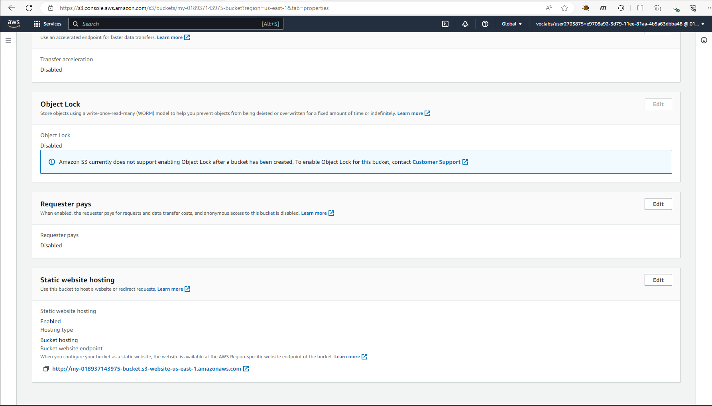
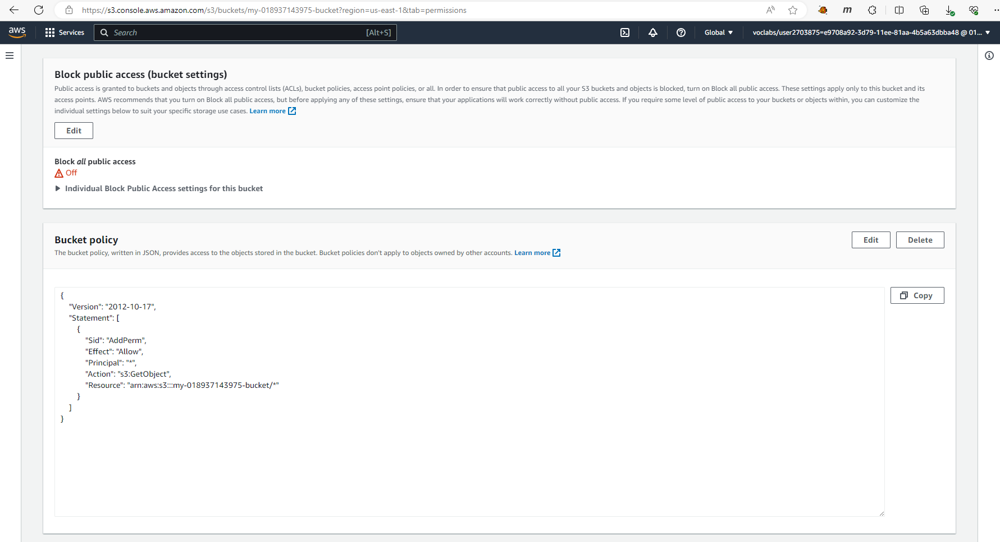
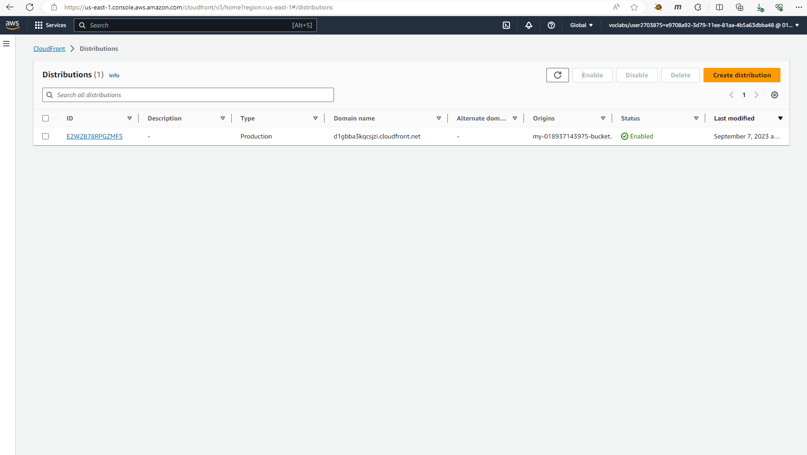
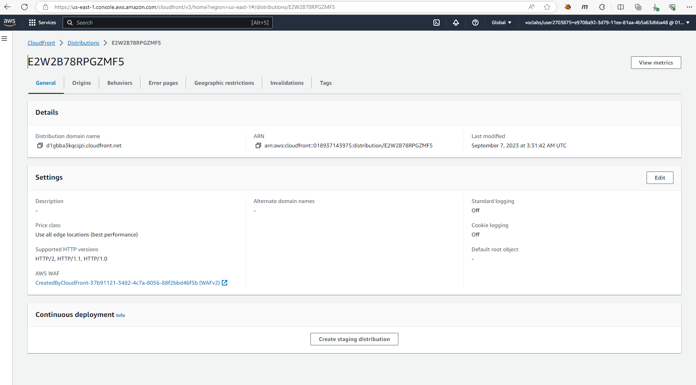

# Create S3 Bucket

# Secure Bucket via IAM

# Distribute Website via CloudFront

# Access Website in Web Browser
  ## Website cloudfront domain
  
  ## Website endpoint domain
  
  ## Website object url domain
  
  
# [My Website: http://my-018937143975-bucket.s3-website-us-east-1.amazonaws.com](http://my-018937143975-bucket.s3-website-us-east-1.amazonaws.com)

# [CloudFront: https://dleyh91lu64vj.cloudfront.net](https://dleyh91lu64vj.cloudfront.net)
